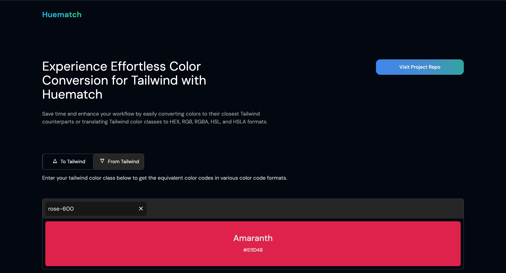
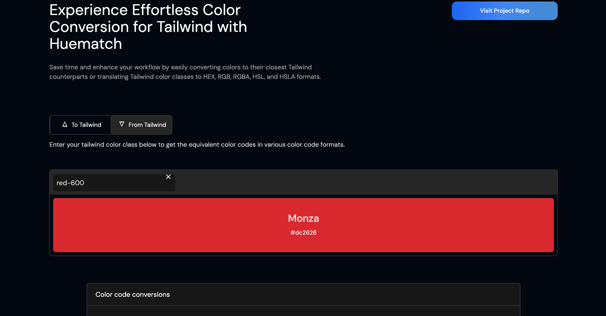
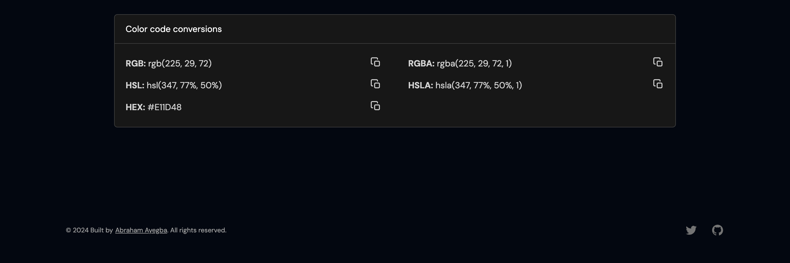

<a href="https://huematch.vercel.app">
  
  <h1 align="center">Huematch</h1>
</a>

  An essential tool for Tailwind CSS developers, allowing easy color conversion to and from Tailwind classes.

  <a href="#introduction"><strong>Introduction</strong></a> ·
  <a href="#features"><strong>Features</strong></a> ·
  <a href="#usage"><strong>Usage</strong></a> ·
  <a href="#motivation"><strong>Motivation</strong></a> ·
  <a href="#contributing"><strong>Contributing</strong></a>

 

## Introduction

Huematch is a versatile web app specifically tailored for Tailwind CSS users. The application effortlessly finds the equivalent Tailwind class for a given color in various formats and converts Tailwind color classes to other standard formats including HEX, RGB, HSL, RGBA, and HSLA.

## Features

Here are some of the features that Huematch provides out-of-the-box:

- [Tailwind Color Conversion](#tailwind-class-conversion)
- [Standard CSS Color Code Conversion](#standard-css-color-code-conversion)
- [Versatile Color Format Support](#versatile-color-format-support)

### Tailwind Color Conversion

Input a color in any format (HEX, RGB, HSL, RGBA, or HSLA) and get the corresponding Tailwind CSS class.

### Standard CSS Color Code Conversion

Input a Tailwind CSS class and get the corresponding color in any desired format.

### Versatile Color Format Support

Embraces a variety of color formats for maximum compatibility with your existing workflow.

## Usage

To use Huematch, simply input your desired color code or Tailwind CSS class in the appropriate field and the application will instantly provide you with the conversion. You can also copy the converted code to your clipboard with a single click.

## Motivation

Tailwind CSS, a utility-first CSS framework, has become a favorite among the developer community for its efficient and customizable utility classes. One area that often proves to be a challenge for developers, though, is handling color conversions within Tailwind CSS. Converting specific color codes to equivalent Tailwind CSS classes or the inverse can disrupt a developer's workflow, particularly when the color formats extend beyond the widely-used HEX.

Although there are conversion tools available, most of them are primarily focused on converting HEX color codes to Tailwind classes. This excludes a significant group of developers who work with other color formats such as RGB or HSL. Furthermore, finding a tool that converts Tailwind color classes back to different color formats proved to be a gap in the current tool offerings.

Recognizing these challenges, Huematch was conceived to fill this gap and create a more inclusive color conversion tool. MY goal is to provide a seamless solution that caters to all developers, regardless of their preferred color format. Huematch is not just about converting HEX to Tailwind classes; it's about embracing a varieyu of color formats and making the process of working with colors in Tailwind CSS as hassle-free as possible.

## Author

- Abraham Ayegba ([@abrahamayegba](https://twitter.com/abrahamayegba_))

## License

Licensed under the [MIT license](https://github.com/abrahamayegba/huematch/blob/main/LICENSE.md).
